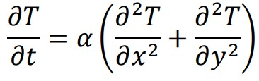

## 2-D Unsteady Heat Conduction problem
The unsteady 2D heat conduction equation is given as 

 

The above equation was solved for a square plate maintained at constant temperatures at the edges. In otherwords a <i>Dirchilet </i> boundary condition was specified. The second order partial differential equation were discretized using Finite difference method. The discretized PDEs were solved using explicit and ADI methods. 

The time evolution of temperature distributaion over the square plate is shown below : 

    

This work was done as a part of Numerical method course -2020 at IIT-Gandhinagar.
