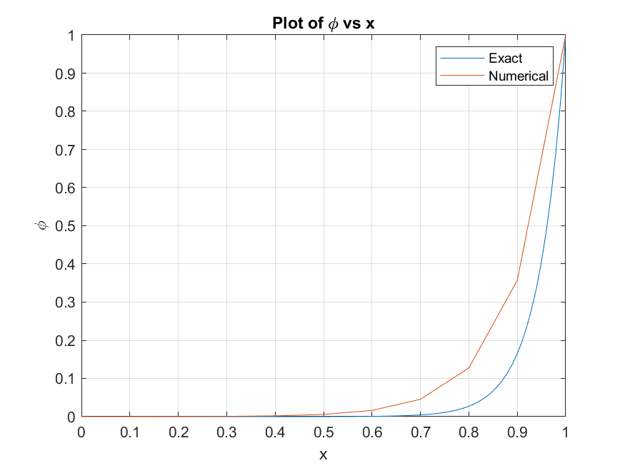
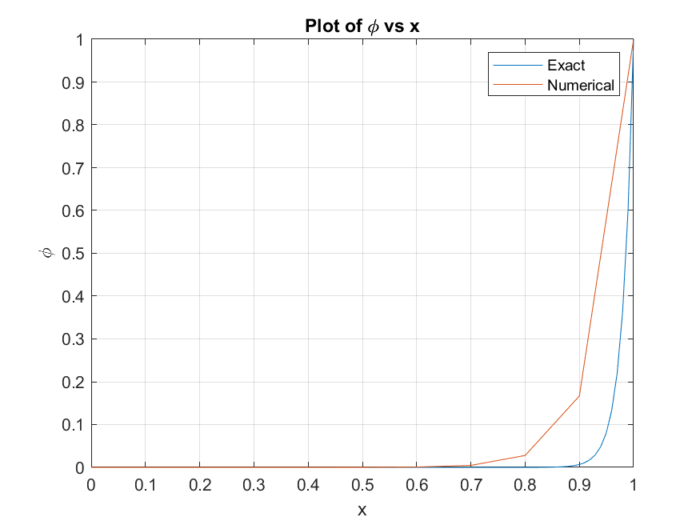

## 1-D steady Convection Diffusion problem
A 1D steady state convection diffusion was solved by various numerical methods. 
    
The solution was compared with uniform grids by changing number of nodes and the Peclet number, Pe. The equation was even solved by using a non-unifrom grid. 

Two plots computed with a uniform grid of 11 nodes for Pe=50 and Pe=18 are shown.

  
  

<!--  |  -->

For deatails see the report.pdf file.
