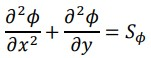
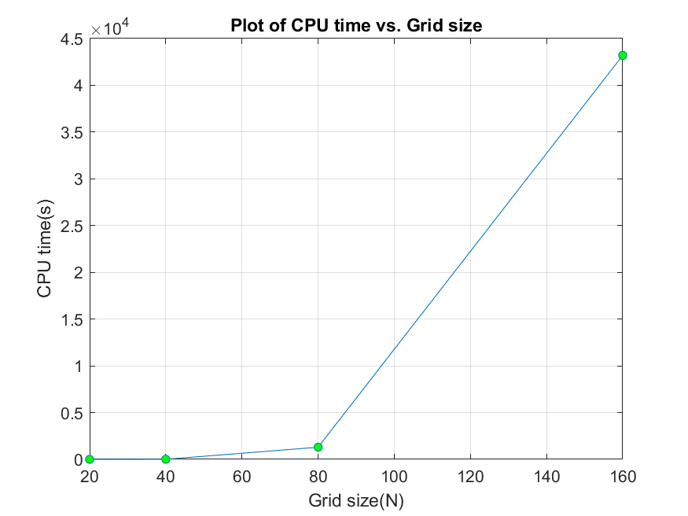
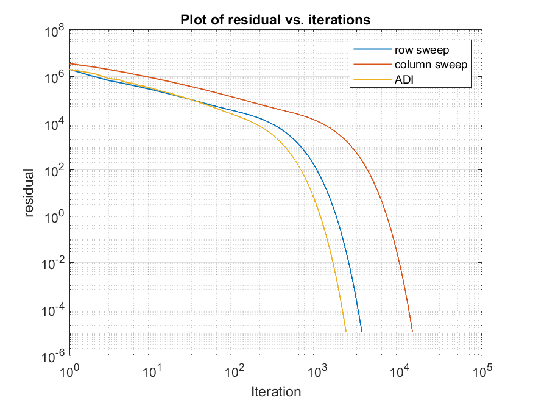
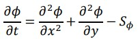

## 2D Convection Diffusion problem
A 2D convection diffusion equation with soruce term was solved in this problem. This project is divided into two parts : part-A and part-B.

Part-A solves the steady-state 2D convection diffusion equation with a given source term and boundary conditions. 

The steady-state equation was solved with wide varity of numeircal methods like Gauss Elimination, Jacobi method, Gauss Seidel method, row-wise and column-wise sweep and ADI method. A few representatiove plots from the project are shown below : 
<table>
  <tr>
    <td></td>
    <td></td>
  </tr>
 </table>
<!--  |  -->

Part-B solves the unsteat-state 2D convection diffusion equation with a given source term and boundary conditions. 

The unsteady equation was solved using various numerical methods like the explicit method, implicit method and Crank Nicolson method. 

 

For deatails see the report.pdf file. 