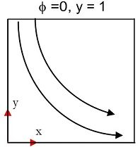

## Scalar transport by Finite Volume
A 2D scalar transport equation for the transport of quantiy &phi; without source term and at steady state conditions was solved using Finite Volume method (FV). The boundary conditions and the velocity field are given. The three popular aprroches of discretizing the convectine term was compared. They are linear interpolation scheme (CDS), upwind difference scheme (UDS) and the QUICK scheme. 

The velocity field and the boundary conditions are shown in the figure below : 

    
    <!--  -->

The contour plots of &phi; for values of diffusivity constant &Gamma;=0.01 and &Gamma;=0.001 are shown below : 

    
    

The plots of flux through the west wall with number of CVs by QUICK and CDS scheme is shown below : 

    
    

