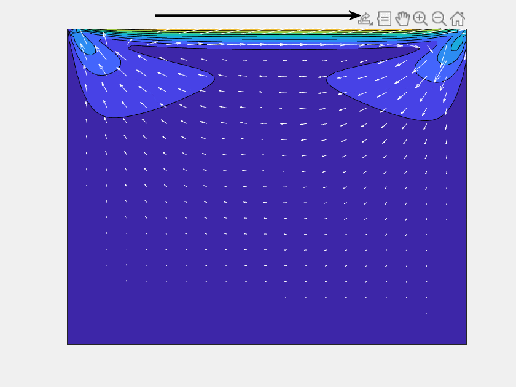

## Lid driven cavity flow
 A standard benchmark problem of lid-driven cavity flow in computational fluid dynamics is solved. Methods like (Quassi) Rhie-chow interpolation, SIMPLE method and Naive method are coded to solve the problem. A Finite Volume (FV) approch was adopted. 
 
 Rhie-chow interpolation method is used to solve the unsteady Navier-Stokes equation. An explicit euler scheme and second-order central differencing scheme was used for convective terms. A collocated grid for pressure and velocity was used. SIMPLE (Semi-Implicit Method for Pressure Linked Equations) was used to solve the steady state Navier-Stokes equation in a staggered mesh arrangement. 

 A brief description of codes is written as follows : 
 * PART_1_Rhie_chow.m contains the Rhie-chow interpolation scheme. It uses Conv_Diff.m to evalute Convection and Diffusion terms. 
 * ADI_helper.m and ADI_helpler_naive.m are pressure poission equation solvers using the ADI method for Rhie-chow and Naive method respectively.
 * CFD_P4_SIMPLE_scheme.m contains the code for SIMPLE scheme. PART_3_Naive.m contains code for Naive method (i.e. directly doing the linear interpoltaion of velocity at faces and not using the Rhie-chow interpolation scheme)

The animation of velocity field computed using Rhie-chow method for a 80 X 80 grid is shown below. 

    

